# CDSS — Smart Credit Decision Support System

Hệ thống hỗ trợ quyết định tín dụng thông minh tích hợp AI/ML đa tầng — phục vụ 14 nghiệp vụ cốt lõi: Dashboard, CRM Khách hàng, Tiếp nhận Đơn vay, AI Scoring, AutoML & Training, Model Governance, Fairness & Bias, AI Explainability, Adversarial Defense, Monitoring & EWS, Workflow Phê duyệt, Portfolio, Compliance & Báo cáo, Quản trị RBAC.

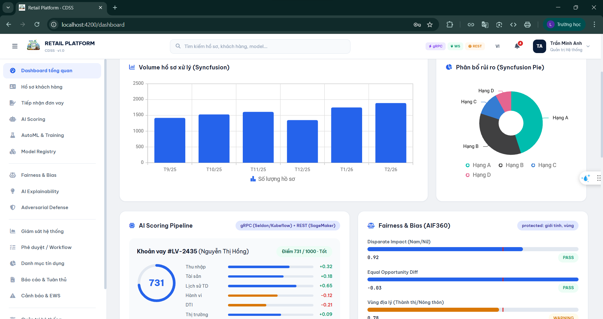
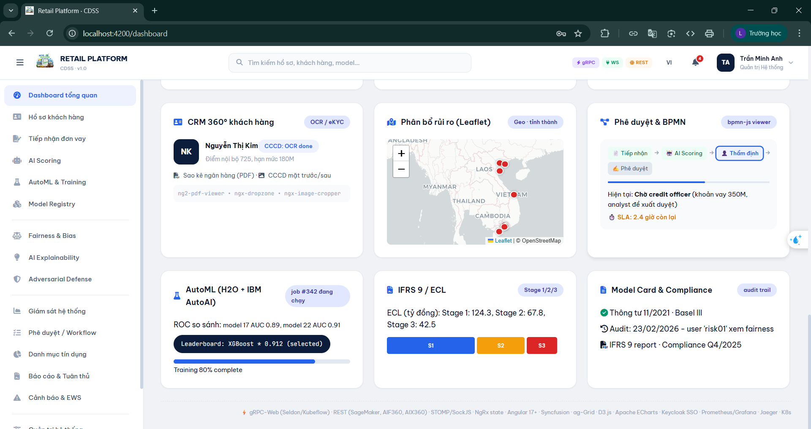
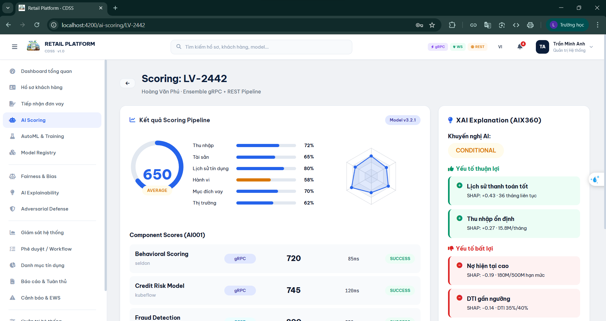
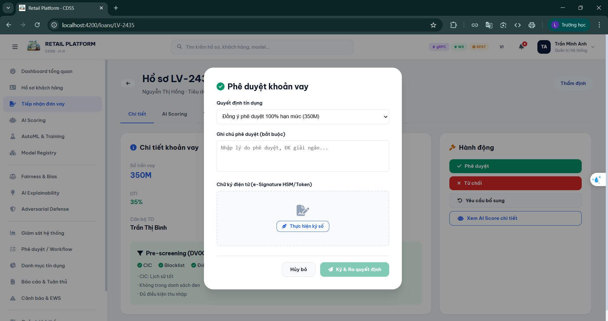
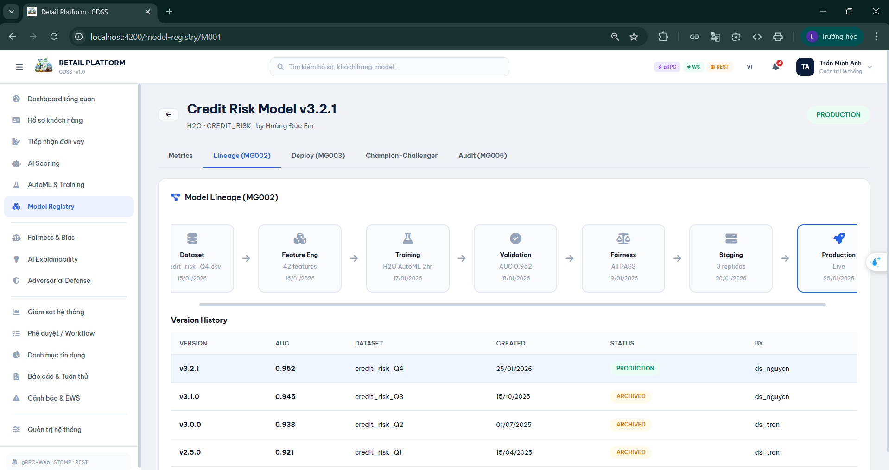
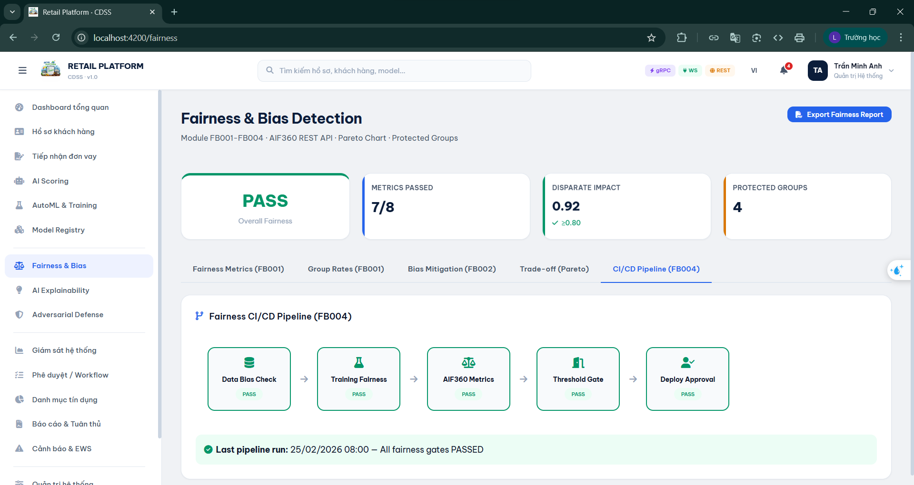
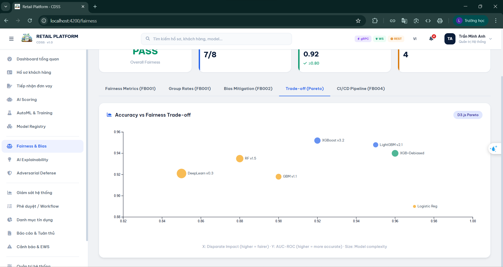
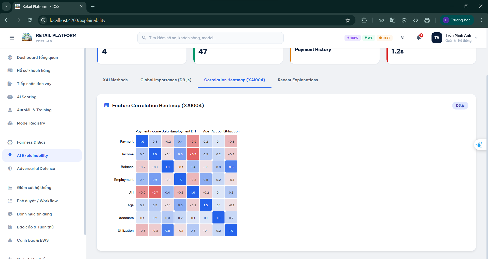
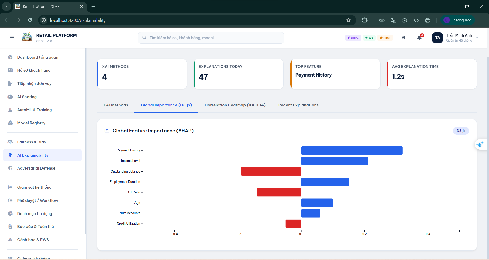
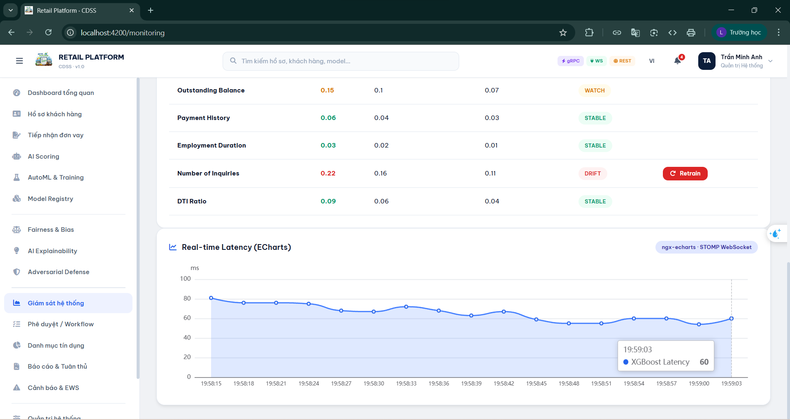
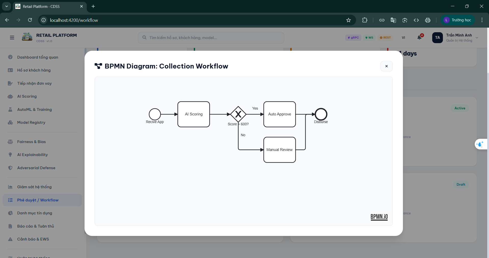
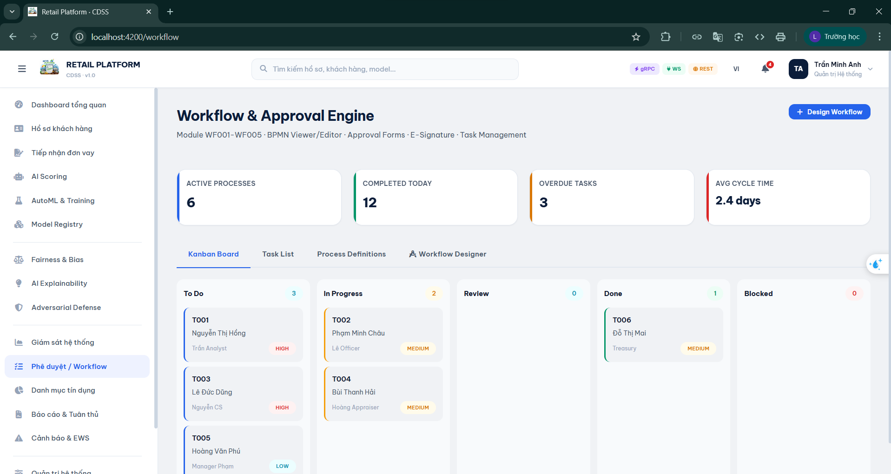
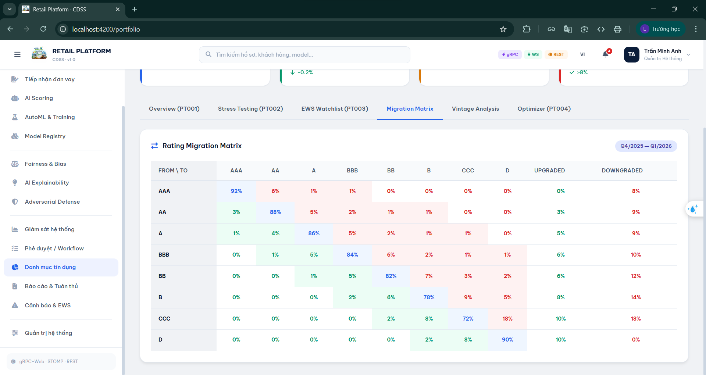
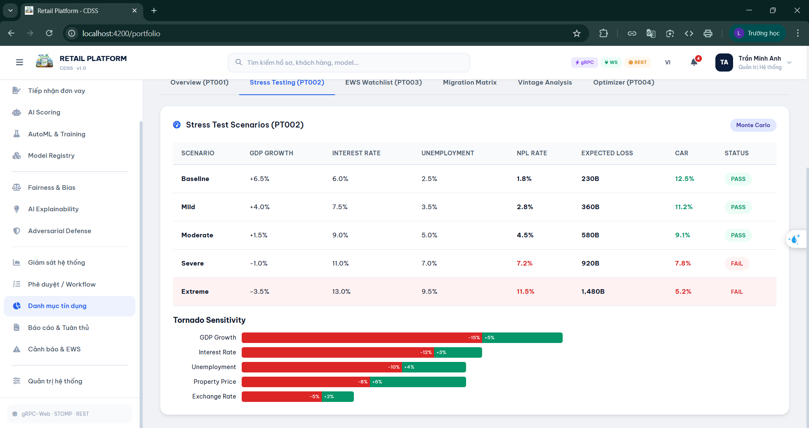
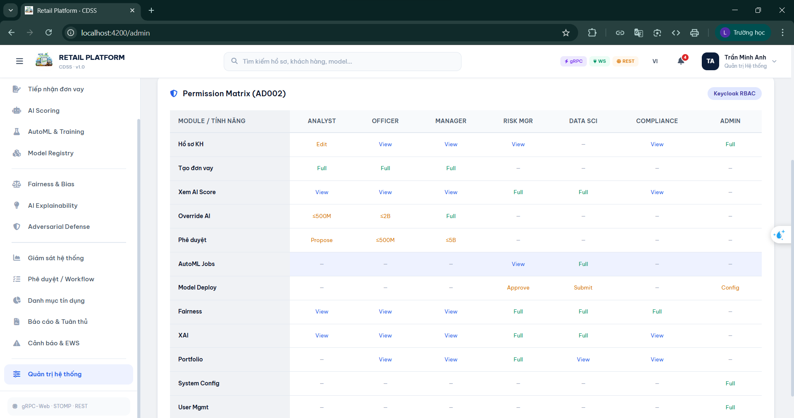

**Frontend** chạy độc lập bằng mock data, sẵn sàng kết nối **10 Go microservices + 5 Python AI services** backend chỉ bằng 1 dòng config.

```
Tech Stack
├── Frontend:   Angular 17 · Syncfusion · ag-Grid · ngx-echarts · D3.js · Leaflet
│               bpmn-js · ng2-pdf-viewer · ngx-dropzone · ngx-image-cropper
│               NgRx · @ngx-translate · @ng-select · RxJS · TypeScript · SCSS · Signals
└── Backend:    Go 1.22 · Echo v4 · PostgreSQL 16 · Redis 7
                Apache Kafka · Seldon Core · Kubeflow Serving
                H2O.ai · AIF360 · AIX360 · ART · ModelDB
                Python 3.11 · FastAPI · Envoy Proxy
                gRPC-Web · WebSocket (STOMP/SockJS) · Docker · Kubernetes
```

---

## Tài liệu

```
READ FIRST/                Đọc trước khi làm bất cứ việc gì
├── architecture.md          Kiến trúc hệ thống, 14 module nghiệp vụ, stack công nghệ, sơ đồ giao thức
└── rbac-matrix.md           3 lớp phân quyền: UI sidebar · API endpoint · data row/column

READ FRONTEND/             Dành cho frontend developer
├── frontend structure.md    Cây file Angular 17, 15 feature modules, 46 files, lệnh chạy
└── mock-data.md             16 phương thức mock, 8 tài khoản demo, mapping Mock → Backend API

READ BACKEND/              Dành cho backend developer
├── backend structure.md     10 Go services + 5 Python AI services, ports, package structure chuẩn
├── api-contracts.md         60+ endpoints REST, request/response JSON, error format, auth header
├── database-schema.md       PostgreSQL DDL, 15+ bảng, indexes, constraints, ER diagram
├── grpc-contracts.md        3 proto files, Seldon/Kubeflow/Scoring, Envoy config, circuit breaker
└── kafka-events.md          7 topics, payload JSON schema, partition strategy, DLQ config

READ DEPLOY/               Dành cho DevOps / người cài đặt
├── docker-compose.md        Toàn bộ hạ tầng 1 file: PostgreSQL + Kafka + Redis + MinIO + Keycloak + Prometheus + Grafana + Jaeger
├── environment window.md    Cài đặt toàn bộ môi trường trên Windows từ đầu
├── coding-conventions.md    Quy tắc code Go · Angular · Python · Git, PR checklist
├── testing-guide.md         Pyramid 70/20/5/5, coverage targets, Testcontainers, CI pipeline
└── troubleshooting.md       Debug startup · runtime · distributed tracing · symptom checklist
```

---

## Chạy nhanh (chỉ Frontend)

```bash
cd "retail frontend"
npm install
ng serve
```

Mở http://localhost:4200 — đăng nhập bằng username và password `123456`.

**8 tài khoản demo:**

| Username | Role | Trang mặc định |
|---|---|---|
| `analyst_an` | Credit Analyst | CRM, Đơn vay, AI Scoring |
| `officer_binh` | Credit Officer | CRM, Đơn vay, Workflow |
| `manager_cuong` | Credit Manager | Tất cả trừ AutoML, Admin |
| `risk_mgr` | Risk Manager | Fairness, XAI, Portfolio, Monitoring |
| `ds_nguyen` | Data Scientist | AutoML, Model Registry, Adversarial |
| `compliance_01` | Compliance Officer | Fairness, XAI, Compliance |
| `admin` | System Admin | Tất cả modules |
| `cs_giang` | Customer Service | CRM only |

---

## Kết nối Backend

Frontend hiện dùng mock data nội bộ. Khi backend sẵn sàng, kết nối bằng cách:

### 1. Cập nhật `environment.ts`

```typescript
// src/environments/environment.ts
export const environment = {
  production: false,
  apiUrl: 'https://api.cdss.local/api/v1',    // ← API Gateway (Echo :8080)
  wsUrl: 'ws://localhost:15674/ws',            // ← STOMP broker
  grpcUrl: 'https://seldon.cdss.local:8443',   // ← Envoy gRPC-Web proxy
};
```

### 2. Thay MockDataService → HttpClient

```typescript
// Trước (mock)
this.mockData.getCustomers()

// Sau (backend thật)
this.http.get<Customer[]>(`${environment.apiUrl}/customers`, {
  params: { page: '1', pageSize: '20' }
})
```

### 3. Kích hoạt STOMP WebSocket

```typescript
// stomp.service.ts — bỏ comment 3 dòng:
this.rxStomp = new RxStomp();
this.rxStomp.configure(this.stompConfig);
this.rxStomp.activate();
this.connected = true;
// → 4 topics tự động nhận data thật: /topic/alerts, /topic/model-metrics, /topic/loan-updates, /topic/ews
```

### 4. Kích hoạt gRPC-Web

```typescript
// grpc.service.ts — thay mock bằng grpc.unary() thật
// Cần: protoc --grpc-web_out → generated TypeScript client stubs
// Envoy Proxy (:8443) tự động transcode gRPC-Web → gRPC tới Seldon/Kubeflow
```

### 5. Kích hoạt Keycloak SSO

```typescript
// auth.service.ts — thay mock login:
// Trước: so sánh username/password hardcode
// Sau:   redirect → Keycloak /auth/realms/cdss/protocol/openid-connect/auth
//        callback → nhận JWT access_token + refresh_token
```

> **Tóm tắt:** 5 thay đổi trên là đủ để frontend kết nối toàn bộ backend. Không cần sửa template hay component nào — chỉ thay data source.

